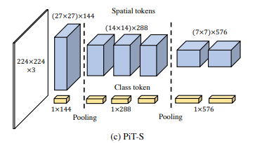

# Pooling based Transformer (PiT)

**原始论文：Rethinking Spatial Dimensions of Vision Transformers.**

方法：将下采样操作融入到ViT架构中，仍然采用全局attention，同时class token需要随着调整通道数量

最近因为在做的工作需要在各种ViT上验证想法，而这个工作可以看作是介于全局attention和局部attention之间的过渡工作，也引入了偏执归纳，所以将它纳入了我的考察范围。这个工程只涉及了对原论文网络架构的一些改进尝试。


我的改进：取消class token，用GAP代替，同时原论文的patch embedding是overlap的(即patch之间有重叠，不是原来那种stride等于patch_size的卷积)，我尝试了将overlap取消，用原始ViT的patch embedding方式，效果居然普遍更好。另外他的下采样是将sequential tokens重新变为二维平面用组卷积(组数等于输入通道数)实现的，把组卷积变成普通卷积可以提升性能(当然也增加了参数)

以下实验结果为在pit_tiny的改造网路上进行的，学习率都是0.001

## Results (Top-1 Accuracy)

### CIFAR100

| drop_path参数 | 下采样卷积方式 | patch_embedding方式 | 准确率 |
| :---: | :----: | :------: | :-------: |
| 0.0 | 组卷积 | overlap | 70.66 |
| 0.1 | 组卷积 | overlap | 72.56 |
| 0.5 | 组卷积 | overlap | 73.69 |
| 0.5 | 全卷积 | overlap | 74.12 |
| 0.0 | 组卷积 | no_overlap | 71.05 |

结论：对于PiT网络, 采用drop_path、下采样时放弃组卷积、patch_embedding时放弃overlap至少在cifar小数据集上是有益的，说明PiT的一些设计，尤其是用overlap的patch_embedding是有待商榷的


## Quick Start

### 1. Prepare dataset

* CIFAR: download cifar dataset to folder `~/datasets/cifar` (you may specify this in configuration files).
* ImageNet: download ImageNet dataset to folder `~/datasets/ILSVRC2012` and pre-process with this [script](https://gist.githubusercontent.com/antoinebrl/7d00d5cb6c95ef194c737392ef7e476a/raw/dc53ad5fcb69dcde2b3e0b9d6f8f99d000ead696/prepare.sh).
* We also support other datasets such as CUB200, Sketches, Stanford Cars, TinyImageNet.

### 2. Prepare cv-lib-PyTorch

This code requires [cv-lib-PyTorch](https://github.com/zhfeing/cv-lib-PyTorch/tree/bootstrapping_vits). You should download this repo.

### 3. Requirements

* torch>=1.10.2
* torchvision>=0.11.3
* tqdm
* timm
* tensorboard
* scipy
* PyYAML
* pandas
* numpy

### 4. Train from scratch

In dir `config`, we provide some configurations for training, including CIFAR100 and ImageNet-10%.
The following script will start training `pit-tiny` from scratch on CIFAR100.
我们这里只注册了PiT模型~
> For training with SAM optimizer, the option `--worker` should be set to `sam_train_worker`.

```bash
export CUDA_VISIBLE_DEVICES=1,3

port=9980
python dist_engine.py \
    --num-nodes 1 \
    --rank 0 \
    --master-url tcp://localhost:${port} \
    --backend nccl \
    --multiprocessing \
    --file-name-cfg cls \
    --cfg-filepath config/cifar100/pit/pit-tiny.yaml \
    --log-dir run/cifar100/pit/pit-tiny \
    --worker worker
```

> After training, the accuracy of the final epoch is reported instead of the best one.
